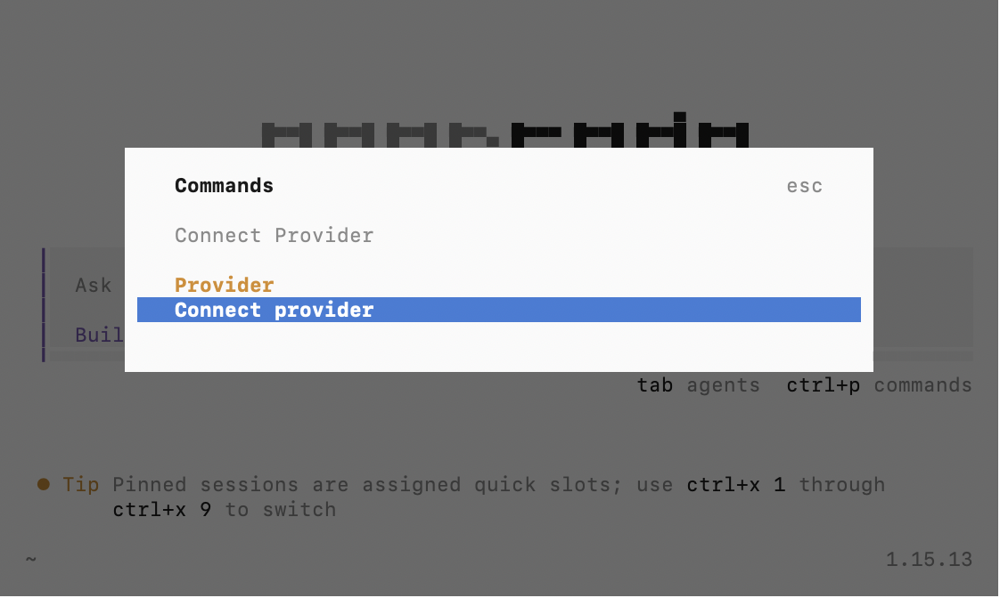
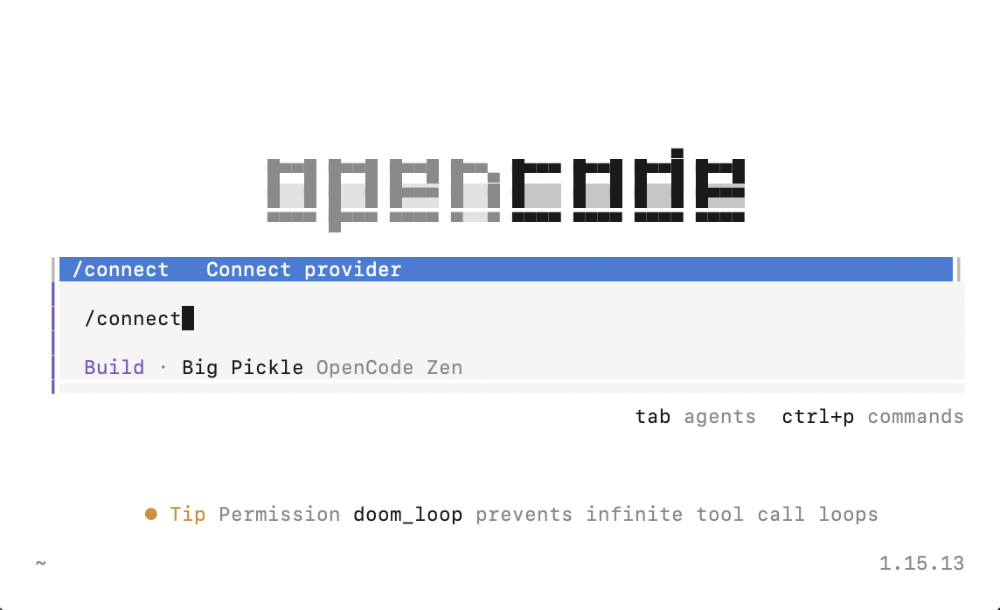
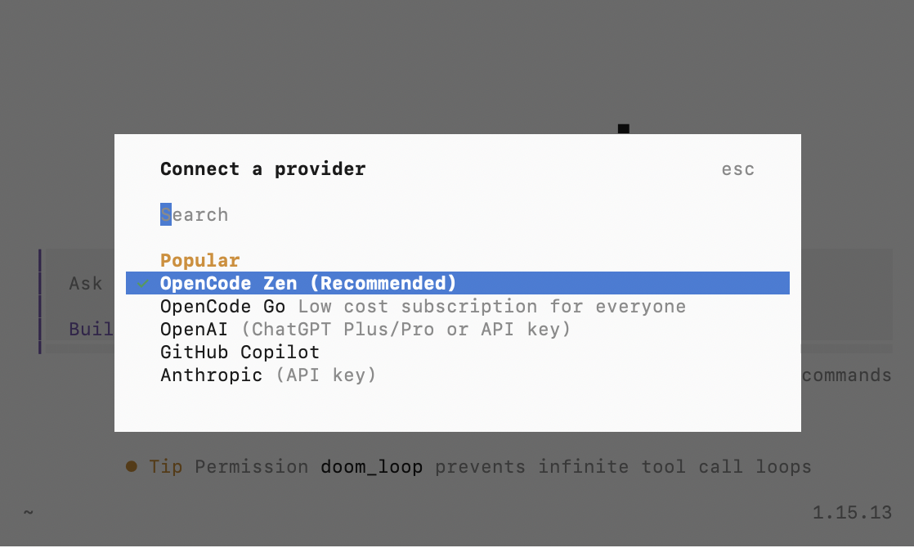
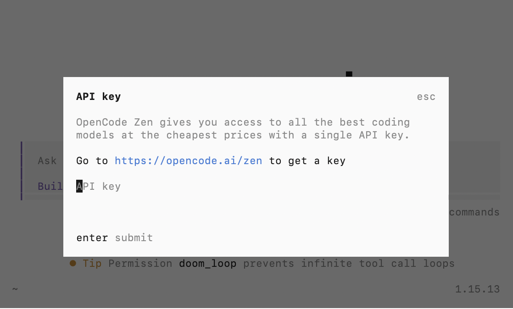
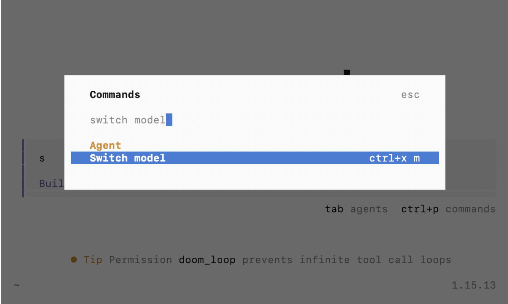
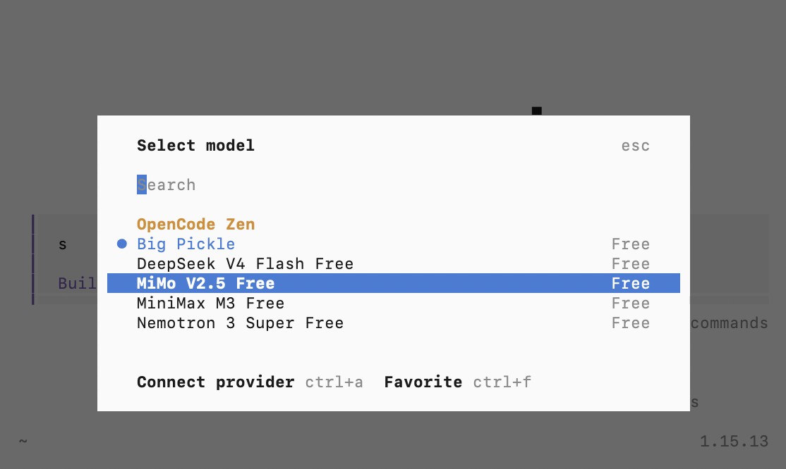
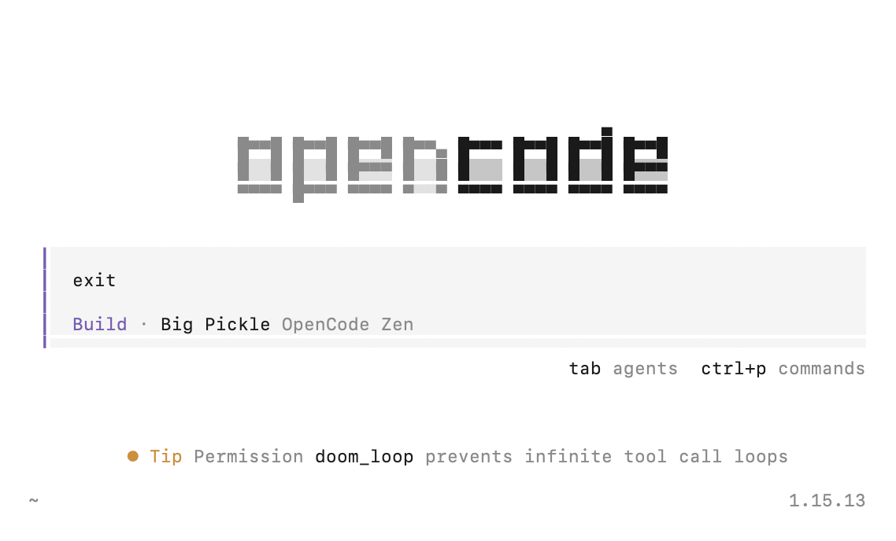

# Exercise 1: Configure OpenCode

1. Open terminal (for Mac users), command prompt (for windows users), or VS Code terminal
   
Enter `opencode` and you should see the OpenCode terminal as below:

    

2. In the OpenCode terminal, do a `ctrl` + `p` to access the **Commands** option.
   
Select `Connect Provider` to connect to a LLM (Large Language Model) provider.

   

    > **Alternatively:** Enter `/connect` to get to this command

    

3. Choose a Provider by pressing the ↑/↓ keys (for this workshop, we recommend to use [OpenCode Zen](https://opencode.ai/zen))

   > **Note:** OpenCode Zen is a pre-configured, curated model list that doesn't require individual OpenAI/Anthropic keys, which is great for a group setting!

   

   Register for a free account to use the free models. Copy the API key for setup in the next step!

    

4. Select `OpenCode Zen` in the OpenCode terminal, and paste in the API key you've copied

    

5. Once setup is done, do a `ctrl` + `p` to access the **Commands** option and enter `Switch Model` to select your LLM model.

   

   > **Note:** Make sure to pick something that is `FREE`.

   

6. To get out of OpenCode, enter `exit` in the OpenCode terminal
   
   
