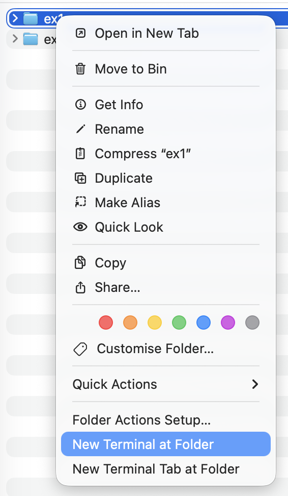

# Exercise 2: Writing code with Plan Mode

Now that we've installed and setup `OpenCode`, we will be writing first piece of code with `OpenCode`!

### Pre-Requisites:
Ensure the following have been installed and set up beforehand:

- [HomeBrew](https://brew.sh/): for MacOS users
- [NodeJs](https://nodejs.org/en/download): for Windows users
- [Git](https://git-scm.com/install/)

<u>Python Users:</u>
- [python3](https://www.python.org/downloads/)
- [pip](https://pip.pypa.io/en/stable/installation/) or [uv](https://docs.astral.sh/uv/guides/install-python/)


### Steps:

1. Create a folder `vc_exercises`, and create another folder 'ex1' inside this folder

   > **Alternatively:** You can run the following:

    ```bash
    cd ~
    mkdir -p /Users/YOUR-MACHINE-USERNAME/desktop/vc_exercises/ex1
    ```

2. Run the following command in terminal (for Mac users), command prompt (for windows users), or VS Code terminal

    ```bash
    cd /Users/YOUR-MACHINE-USERNAME/desktop/vc_exercises/ex1
    ```

   <p>Enter `opencode` and you should see the OpenCode terminal as below:

    

   <p>
   For Macbook users, you can open the terminal from the folder itself

    

   And enter `opencode`

3. In your OpenCode terminal, run `/init`.<p>
   This creates an `AGENTS.md`, which is the "brain" OpenCode uses to understand your specific codebase.

## Plan Mode

OpenCode has a *Plan mode* that disables its ability to make changes and instead suggest how it’ll implement the feature.

1. Press the `<tab>` key to enter *Plan Mode*.

2. Let's try to build a simple tic-tac-toe game.

    Copy and paste the following instructions into your OpenCode terminal:

    ```
    I want to build a simple Tic Tac Toe game that runs in the terminal.

    Before writing any code:

    1. Define the requirements and game rules.
    2. Identify the main components and data structures needed.
    3. Describe the game flow from start to finish.
    4. List the functions/classes that should be implemented and their responsibilities.
    5. Identify edge cases and error handling requirements.
    6. Propose a simple project structure.
    7. Create an implementation plan broken into small, testable steps.

    Keep the design simple and suitable for a beginner developer. Do not generate code yet—focus only on planning and architecture.
    ```

3. Follow the on screen instructions and let's see what it builds.

4. You can chat and discuss changes if you don't agree with anything that was suggested.

5. Remember to exit *Plan Mode* before executing (press `<tab>` key again).

    Copy and paste this into your OpenCode chat box:
    
    ```
    Let's go
    ```

6. Use VScode to see what's being added to the folder.

7. Can proceed to play the game in terminal (you can open a new terminal tab).

8. You can exit the OpenCode by typing: `exit` and press `<enter>`.

    > **Pro-Tip:** Notice that you can get back into the same session with the command shown on screen.