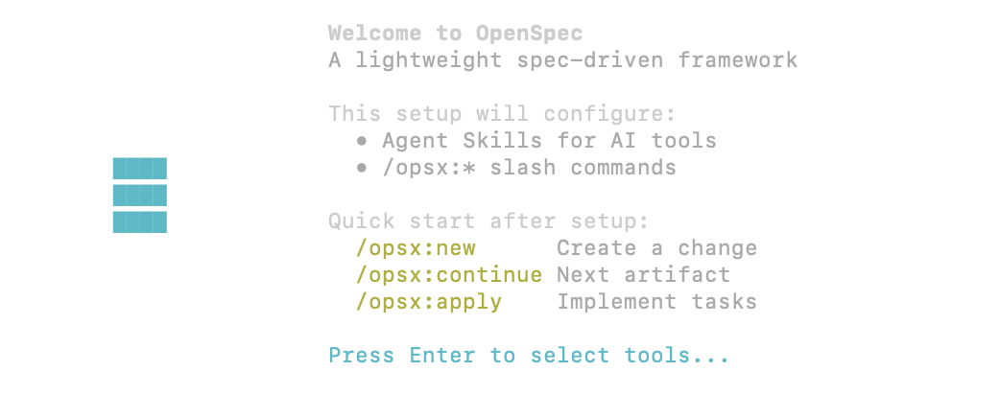
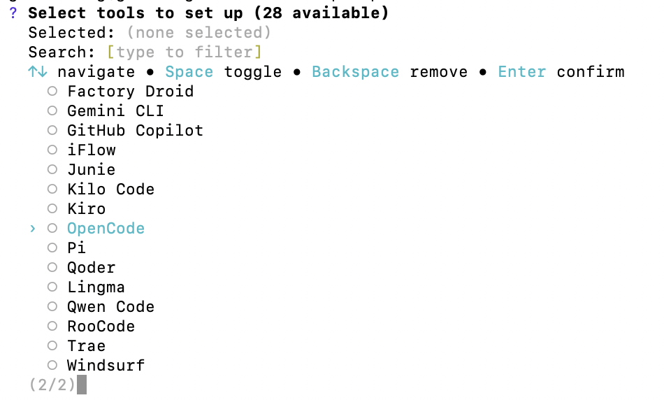

# Exercise 3: Spec Driven Development (OpenSpec)

Please note that this exercise is for `Javascript` environment only! For users using the `Python` environment, refer to [exercise3b](exercise3b.md) instead.

### Pre-Requisites:
Ensure the following have been installed and set up beforehand:

- [HomeBrew](https://brew.sh/): for MacOS users
- [NodeJs](https://nodejs.org/en/download): for Windows users
- [Git](https://git-scm.com/install/)


### Steps:

1. Create a folder `vc_exercises`, and create another folder `ex2` inside this folder

   > **Alternatively:** You can run the following:

    ```bash
    cd ~
    mkdir -p /Users/YOUR-MACHINE-USERNAME/desktop/vc_exercises/ex1
    ```

2. Run the following command in terminal (for Mac users), command prompt (for windows users), or VS Code terminal

    ```bash
    cd /Users/YOUR-MACHINE-USERNAME/desktop/vc_exercises/ex2
    ```

   <p>Enter `opencode` and you should see the OpenCode terminal as below:

    

   For Macbook users, you can open the terminal from the folder itself and enter `opencode`

3. In your terminal, run the command below to initialise Git in this folder:

    ```bash
    git init
    ```

4. Now, let's install [OpenSpec](https://github.com/Fission-AI/OpenSpec/) and initialise `OpenSpec` in this project folder

    ```bash
    npm install -g @fission-ai/openspec@latest

    openspec init
    ```

   Alternatively for MacOS users:

    ```bash
    brew install -g @fission-ai/openspec@latest

    openspec init
    ```

    You should see the following screen:

    
<p>

5. Hit the `Enter` key
    - Press `<up>` or `<down>` key to find `OpenCode`. 
    - Press `<space>` key to select the tool. 
    - Press `<enter>` to confirm the selection.


    Press `<down>` till you see **OpenCode** and press `<space>` key to select.

    
    <p>


6. Enter `opencode` and you should see the OpenCode terminal as below:

    
    <p>

7. Use this prompt to build a web application:

    ```bash
    /opsx-propose "Build a small web app where a user types in their current mood (e.g., 'Tired', 'Celebratory', 'Lazy') and the app suggests a 3-ingredient recipe."
    ```

8. Go to your `ex2` folder to review the artifacts in the `openspec` folder. <p>
   Alternatively, you can use VSCode to open the project folder to review the changes.

9. You will notice that the proposal does not include an image of the recipe. <p>
   You may do so by entering the prompt below to the `OpenCode` terminal:

    ```
    I would like to include a photo of the recipe in the display page.
    ```

10. Once you are happy with the proposal, start the implementation with the command below:

    ```bash
    /opsx:apply
    ```


11. Sometimes things might stall. Just press `<esc>` twice and type: `continue` and press `<enter>` to continue where it hung.

12. Test out the app in a separate terminal.

    ```bash
    npm start
    ```

13. If there are bugs or you have ideas to enhance things, just type in the statement into OpenCode:

    ```
    The images are not showing in the web page
    The loading spinner and text "Cooking up an idea..." is still showing after i get a recipe.
    Shall we use recipe photos from Unsplash?
    ```

    And see how it fixes the problem or enhance the app.

14. Once you are happy, can archive the work:

    ```
    /opsx:archive
    ```

## Troubleshooting:


If things get stuck, might be due to the application server running in the background.

```
pa aux | grep node
```

Find the process number and kill it:

```
kill -9 1234455
```