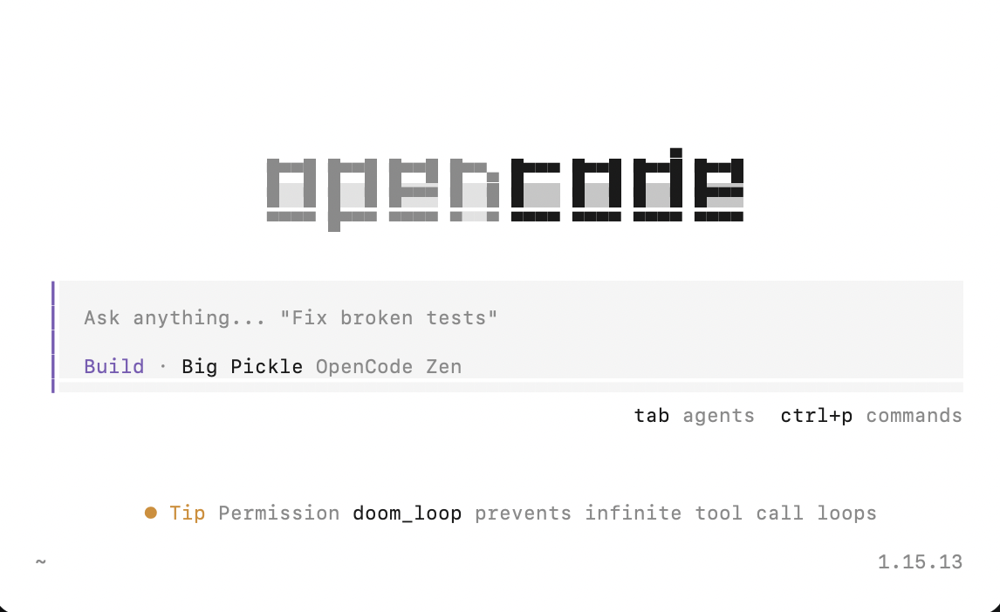

# Exercise 3: Spec Driven Development (SpecKit)

Please note that this exercise is for `Python` environment only! For users using the `Javascript` environment, refer to [exercise3a](exercise3a.md) instead.

### Pre-Requisites:
Ensure the following have been installed and set up beforehand:

- [HomeBrew](https://brew.sh/): for MacOS users
- [NodeJs](https://nodejs.org/en/download): for Windows users
- [Git](https://git-scm.com/install/)


### Steps:

1. Create a folder `vc_exercises`, and create another folder `ex2` inside this folder

   > **Alternatively:** You can run the following:

    ```bash
    cd ~
    mkdir -p /Users/YOUR-MACHINE-USERNAME/desktop/vc_exercises/ex1
    ```

2. Run the following command in terminal (for Mac users), command prompt (for windows users), or VS Code terminal

    ```bash
    cd /Users/YOUR-MACHINE-USERNAME/desktop/vc_exercises/ex2
    ```

   <p>Enter `opencode` and you should see the OpenCode terminal as below:

    

   For Macbook users, you can open the terminal from the folder itself and enter `opencode`

3. In your terminal, run the command below to initialise Git in this folder:

    ```bash
    git init
    ```

4. Now, let's install [SpecKit](https://github.com/github/spec-kit) and initialise `SpecKit` in this project folder

    ```bash
    uv tool install specify-cli --from git+https://github.com/github/spec-kit.git@v0.8.18

    specify init --here
    ```

5. Select **OpenCode** as the coding agent integration.

    - Press `<up>` or `<down>` key to find `opencode`. 
    - Press `<enter>` to confirm the selection.

7. Select your script type (`sh` for bash/zsh or `ps` for PowerShell)

8. Start **OpenCode** from this project folder.

9. Use this prompt to establish project principles:

    ```
    /speckit.constitution Create principles focused on code quality, testing standards, user experience consistency, and performance requirements
    ```

    You can see the Constitution file here: `.specify/memory/constitution.md`

10. Use this prompt to establish what you want to build:

    ```
    /speckit.specify Build a small web app where a user types in their current mood (e.g., 'Tired', 'Celebratory', 'Lazy') and the app suggests a 3-ingredient recipe.
    ```

11. Review the artifacts in the `specs/001-mood-recipe` folder. Use VSCode to open the project folder to review the changes.

12. Chances are, the proposal does not include an image of the recipe.

    ```
    I would like to include a photo of the recipe in the display page.
    ```

13. Use the `/speckit.plan` command to provide your tech stack and architecture choices.

    ```
    /speckit.plan The application uses FastAPI with minimal number of libraries. Use vanilla HTML, CSS, and JavaScript as much as possible. Use images from Unsplash and metadata is stored in a local JSON database.
    ```

14. Review the new artifacts in `specs/001-mood-recipe` folder. Use VSCode to open the project folder to review the changes.

15. Run the command below to start preparing the tasks.

    ```bash
    /speckit.tasks
    ```

16. Run the command below to start implementing.

    ```bash
    /speckit.implement
    ```

17. Test out the app in a separate terminal.

    Follow the instructions in `specs/001-mood-recipe/quickstart.md`:

    ```bash
    cd backend
    uvicorn app.main:app --reload --port 8000
    ```

    Open browser to <http://localhost:8000>.
    